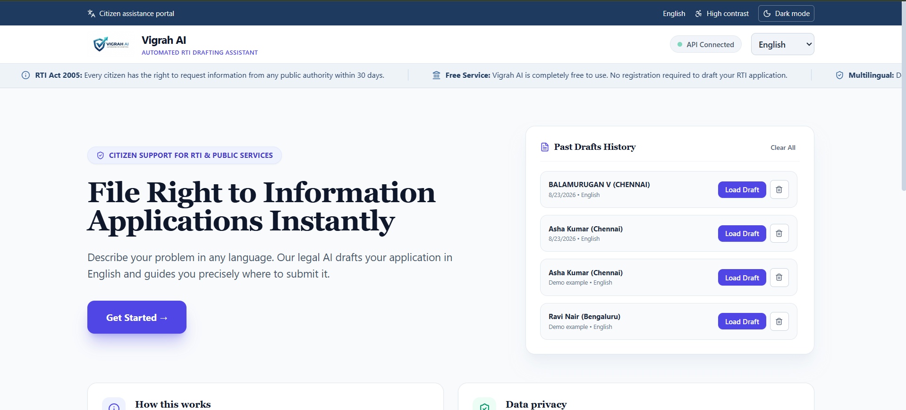
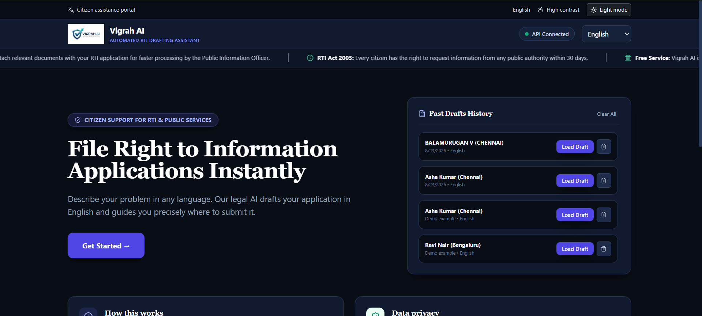
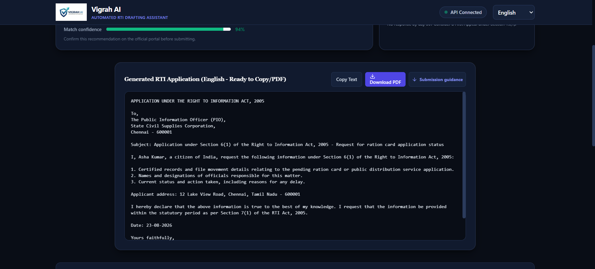

# Vigrah AI

> Make public services easier to understand, access, and follow up.

Vigrah AI is a citizen-support application for preparing clear Right to Information (RTI) applications and discovering relevant public-service guidance. It combines a React interface with a FastAPI backend and supports multilingual workflows for citizens in India.

> **Disclaimer:** Vigrah AI is an independent informational tool. It is not a Government of India website, does not submit applications on a citizen's behalf, and does not replace official instructions or legal advice. Always verify details on the relevant government portal before submitting.

## Live Links

- **Repository:** [github.com/balamurugan250033-lgtm/Vigrah-AI](https://github.com/balamurugan250033-lgtm/Vigrah-AI)
- **Production website:** [vigrah.vercel.app](https://vigrah.vercel.app/)
- **Frontend (local):** [http://localhost:3000](http://localhost:3000)
- **Backend health check (local):** [http://localhost:8000](http://localhost:8000)
- **Interactive API docs (local):** [http://localhost:8000/docs](http://localhost:8000/docs)

## Screenshots

<p align="center">
  <b>Home dashboard (light and dark mode)</b><br>
  
  
</p>

<p align="center">
  <b>Generated RTI draft and PDF export</b><br>
  
</p>

## What It Does

- **Automated RTI drafting:** Generates structured RTI application drafts from a citizen's issue.
- **Smart routing:** Routes common problems toward a likely ministry or public authority.
- **Submission guidance:** Provides submission guidance and next steps after drafting.
- **Multilingual workflows:** Supports English and India's scheduled-language workflows.
- **Voice input:** Offers voice input where the browser supports Speech Recognition.
- **Local persistence:** Stores draft history locally in the browser for convenient follow-up.
- **Rights and schemes:** Includes public-service rights and government-scheme tools.

## Technology

| Layer | Technology |
| --- | --- |
| Frontend | React 19, Tailwind CSS, Create React App |
| Backend | FastAPI, Uvicorn, Python |
| Client requests | Fetch API and Axios |
| Local persistence | Browser `localStorage` |

## Run Locally

### Prerequisites

- Python 3.10 or newer
- Node.js 18 or newer
- npm

### 1. Start the backend

From the repository root:

```powershell
cd backend
python -m pip install fastapi uvicorn
python -m uvicorn app.main:app --reload --port 8000
```

The API will be available at `http://localhost:8000` and its Swagger documentation at `http://localhost:8000/docs`.

### 2. Start the frontend

Open a second terminal:

```powershell
cd frontend
npm install
npm start
```

Open [http://localhost:3000](http://localhost:3000) in your browser.

The frontend proxies `/api` requests to the local backend. On Vercel, the included `api/index.py` serverless entry point serves the same API routes from the same deployment.

### Windows shortcut

From the repository root, run `frontend\start.bat` to launch both services in separate terminal windows. The shortcut assumes Python dependencies are already installed and that `uvicorn` is available on `PATH`.

### Deploy on Vercel

Import the GitHub repository root (`Vigrah-AI`) as the Vercel project. Leave **Root Directory** blank; do not select `frontend` as the project root. The root `vercel.json`, `api/index.py`, and `requirements.txt` configure the React build and FastAPI serverless function together. After deployment, verify `https://your-domain.vercel.app/api/health` returns JSON with `status: online`.

## API Surface

| Method | Endpoint | Purpose |
| --- | --- | --- |
| `GET` | `/` | Backend health check |
| `POST` | `/generate-rti` | Generate an RTI draft |
| `POST` | `/api/rti/draft` | Generate an RTI draft for the RTI tool |
| `POST` | `/api/rights/navigate` | Get rights and navigation guidance |

Use the interactive documentation at `/docs` for request schemas and testing.

## Project Structure

```text
Vigrah-AI/
├── backend/
│   └── app/
│       └── main.py          # FastAPI application and API routes
├── frontend/
│   ├── src/
│   │   ├── components/      # Dashboard and citizen tools
│   │   └── App.js           # Application shell and navigation
│   └── start.bat            # Windows launcher
├── docs/screenshots/        # README product screenshots
└── README.md
```

## Development

Build the frontend for production with:

```powershell
cd frontend
npm run build
```

Run the frontend test suite with:

```powershell
npm test
```

## Security and Privacy

- Never commit `.env` files, API keys, service-account credentials, or personal citizen data.
- Keep secrets in environment variables or a local secret manager.
- Draft history is stored in the user's browser and is not a server-side case-management system.
- Review generated content before submitting it to an official portal.
- Vigrah AI provides informational assistance and does not replace legal advice or official government guidance.

## License

This project is licensed under the [MIT License](LICENSE).
